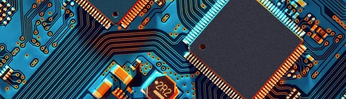

  

# PC Essentials  
Aprenderemos las bases de la tecnologia empezando desde cero.  

## Temas  
[Sistemas Operativos](https://www.youtube.com/w)  
[Windows](https://www.youtube.com/w)  
[Linux](https://www.youtube.com/w)  
[Virtual Machines](https://www.youtube.com/w)  

## Windows Quick Cheatsheet

### Comandos rápidos
| Comando                        | Descripción                                   | 
|--------------------------------|-----------------------------------------------|
| `docker images -a`             | Muestra la versión más corta.                 |
| `docker pull mongo`            | Descarga imagen.                              | 

## Linux Ubuntu Quick Cheatsheet

### Comandos rápidos 
| Comando                        | Descripción                                   | 
|--------------------------------|-----------------------------------------------|
| `docker images -a`             | Muestra la versión más corta.                 |
| `docker pull mongo`            | Descarga imagen.                              | 

